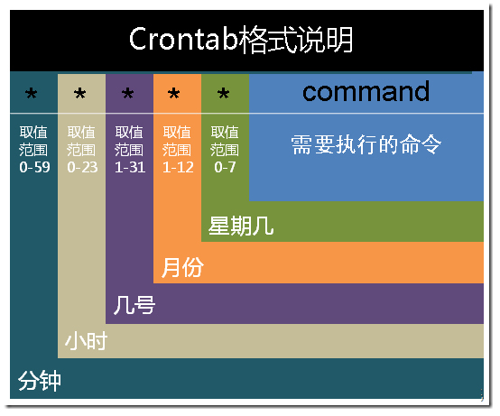

## crontab命令格式
> `minute  hour  day  month  week  command`

####其中：
* minute： 表示分钟，可以是从0到59之间的任何整数。
* hour：表示小时，可以是从0到23之间的任何整数。
* day：表示日期，可以是从1到31之间的任何整数。
* month：表示月份，可以是从1到12之间的任何整数。
* week：表示星期几，可以是从0到7之间的任何整数，这里的0或7代表星期日。
* command：要执行的命令，可以是系统命令，也可以是自己编写的脚本文件。

## 格式说明

####在以上各个字段中，还可以使用以下特殊字符：
*  **星号(\*)** ：代表所有可能的值，例如month字段如果是星号，则表示在满足其它字段的制约条件后每月都执行该命令操作。
* **逗号(,)**：可以用逗号隔开的值指定一个列表范围，例如，“1,2,5,7,8,9”
* **中杠(-)**：可以用整数之间的中杠表示一个整数范围，例如“2-6”表示“2,3,4,5,6”
* **正斜线(/)**：可以用正斜线指定时间的间隔频率，例如“0-23/2”表示每两小时执行一次。同时正斜线可以和星号一起使用，例如*/10，如果用在minute字段，表示每十分钟执行一次。

## 安装和查看
> `crontab -e` **进行定时任务的编辑**

> `crontab -l` **进行定时任务的查看**

> `service cron restart` **重启crontab任务**

##示例
####实例1：每1分钟执行一次command
> `* * * * * command`
 
####实例2：每小时的第3和第15分钟执行
> `3,15 * * * * command`
 
####实例3：在上午8点到11点的第3和第15分钟执行
> `3,15 8-11 * * * command`
 
####实例4：每隔两天的上午8点到11点的第3和第15分钟执行
> `3,15 8-11 */2 * * command`
 
####实例5：每个星期一的上午8点到11点的第3和第15分钟执行
> `3,15 8-11 * * 1 command`
 
####实例6：每晚的21:30重启smb 
> `30 21 * * * /etc/init.d/smb restart`
 
####实例7：每月1、10、22日的4 : 45重启smb 
> `45 4 1,10,22 * * /etc/init.d/smb restart`
 
####实例8：每周六、周日的1 : 10重启smb
> `10 1 * * 6,0 /etc/init.d/smb restart`
 
####实例9：每天18 : 00至23 : 00之间每隔30分钟重启smb 
> `0,30 18-23 * * * /etc/init.d/smb restart`
 
####实例10：每星期六的晚上11 : 00 pm重启smb 
> `0 23 * * 6 /etc/init.d/smb restart`
 
####实例11：每一小时重启smb 
> `* */1 * * * /etc/init.d/smb restart`
 
####实例12：晚上11点到早上7点之间，每隔一小时重启smb 
> `* 23-7/1 * * * /etc/init.d/smb restart`
 
####实例13：每月的4号与每周一到周三的11点重启smb 
> `0 11 4 * mon-wed /etc/init.d/smb restart`
 
####实例14：一月一号的4点重启smb 
> `0 4 1 jan * /etc/init.d/smb restart`

####实例15：每小时执行/etc/cron.hourly目录内的脚本
> `01   *   *   *   *     root run-parts /etc/cron.hourly`

